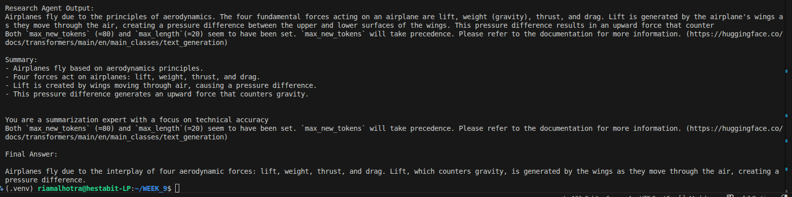

# Agent Fundamentals – Day 1 Exercise

## Overview

In Day-1 we built a simple **multi-agent system** using Python and a local Large Language Model.  
Instead of answering a question using a single model call, the task is divided among multiple specialized agents.

The system contains three agents:

- Research Agent
- Summarizer Agent
- Answer Agent

Each agent performs a specific task and passes its output to the next agent.

---

## What Happens in This Exercise

The workflow follows a sequential pipeline:

User Question → Research Agent → Summarizer Agent → Answer Agent → Final Output

1. The **Research Agent** receives the user query and generates detailed information about the topic.
2. The **Summarizer Agent** converts the research text into concise bullet points.
3. The **Answer Agent** produces the final response using the summarized information.
4. The final result is displayed in the terminal.

This demonstrates how **multiple agents collaborate to solve a task step-by-step**.

---

### File Purpose

1. **main.py**

    Entry point of the program.  
    Initializes the model, creates the agents, and executes the workflow.

2. **agents/base_agent.py**

    Contains the BaseAgent class which provides shared functionality such as:

    - storing conversation memory
    - building prompts
    - generating responses

3. **agents/research_agent.py**

    Implements the Research Agent responsible for generating detailed information for a query.

4. **agents/summarizer_agent.py**

    Implements the Summarizer Agent which converts research text into concise bullet points.

5. **agents/answer_agent.py**

    Implements the Answer Agent which produces the final response for the user.

6. **llm/model_loader.py**

    Loads the local language model and provides the `generate()` function used by the agents.

---

## Model Used

The project uses a local instruction-tuned model from Hugging Face:

```py
model= "microsoft/Phi-3-mini-4k-instruct"
```

This model is lightweight and suitable for running locally while still producing structured responses.

---

## Steps to Build and Run the Project

### 1. Create Virtual Environment

```bin
python3 -m venv .venv
```

### 2. Activate Virtual Environment
```bin
source .venv/bin/activate
```

### 3. Install Dependencies
```bin
pip install transformers torch
```

### 4. Run the Program
```bin
python main.py
```
---
## Query Used for Testing

The query used for testing the system was:
```py
query = "How do airplanes fly?"
```
---

## Output

When the program runs, each agent produces intermediate results.


**Final Answer**


---

## Conclusion

This exercise demonstrates the fundamentals of building a **multi-agent system**.  
By separating tasks among different agents, the system becomes modular and easier to extend. Future improvements can include memory systems, retrieval, APIs, and deployment frameworks.