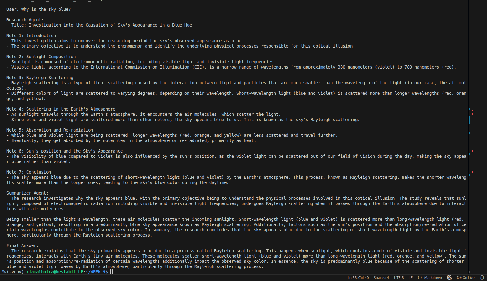

# Agent Fundamentals – Day 1

## Overview

A simple multi-agent pipeline built with **AutoGen AgentChat** and **Mistral** via **Ollama. Three specialized agents collaborate to answer a user query.

---

## Agents

| Agent | Role |
|---|---|
| Research Agent | Gathers detailed factual notes on the topic |
| Summarizer Agent | Condenses research notes into key points |
| Answer Agent | Produces the final user-facing response |

**Flow:** `User → Research Agent → Summarizer Agent → Answer Agent → Output`

---

## Key Concepts

- **Agent Loop:** Perception → Reasoning → Action
- **Message Passing:** Each agent processes the previous agent's output
- **Role Isolation:** Strict separation of responsibilities for modularity
- **Memory Window:** Each agent retains the last 10 messages via `BufferedChatCompletionContext`

---

## Project Structure

```
WEEK_9/
├── agents/
│   ├── research_agent.py
│   ├── summarizer_agent.py
│   └── answer_agent.py
├── model_client.py       # Mistral via Ollama
├── main.py               # Entry point & pipeline coordinator
└── AGENT-FUNDAMENTALS.md
```

---

## Setup & Run

```bash
python3 -m venv .venv && source .venv/bin/activate
pip install autogen-agentchat autogen-ext openai
ollama pull mistral
python main_day1.py
```

---

## output



## Takeaways

- Agents can collaborate to solve tasks more effectively than a single model call
- Memory windows allow agents to retain recent context
- Role isolation keeps each agent focused and the system modular
- This architecture extends naturally to memory, RAG, and task planning