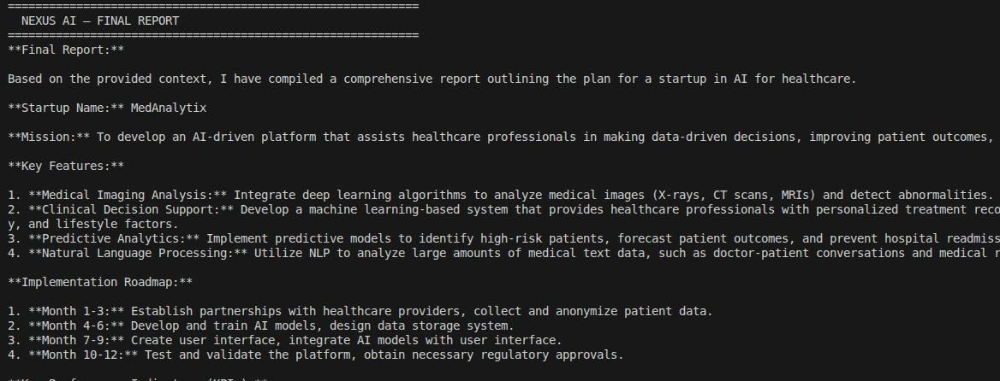

# NEXUS AI — Final Report

**Project:** Week 9 Capstone — Autonomous Multi-Agent AI System
**Author:** Ria Malhotra

---

## 1. Project Summary

NEXUS AI is a fully autonomous multi-agent system capable of processing any technical or strategic query through a pipeline of 9 specialized AI agents. Each agent has a unique role, system prompt, and temperature setting. Agents pass context to each other sequentially, building on each other's work to produce a comprehensive, validated final report.

The system was built entirely using local/free-tier tools with no paid APIs beyond Groq's free tier, fulfilling the Week 9 requirement of a fully local AI task automation system.

---

## 2. Agents Built

| Agent | Role | Key Behavior |
|---|---|---|
| Orchestrator | Master coordinator | Sets big picture, delegates tasks |
| Planner | Project manager | Creates ordered step-by-step plan |
| Researcher | Domain expert | Gathers facts and background knowledge |
| Coder | Developer | Writes and executes Python code |
| Analyst | Data scientist | Analyzes outputs, derives insights |
| Critic | Reviewer | Finds weaknesses, gaps, and errors |
| Optimizer | Improver | Fixes issues raised by Critic |
| Validator | QA engineer | Approves or flags remaining issues |
| Reporter | Writer | Compiles clean final report |

---

## 4. Example Tasks Tested

### Task — Plan a startup in AI for healthcare 
All 9 agents completed. Final report included executive summary, key components, market analysis, business model, team structure, and financial projections.

**mode [1] Output:**



---

## 5. Features Implemented Beyond Requirements

### Output Mode Selection
Users can choose between:
- **Mode 1** — Final report only (clean terminal, no overflow)
- **Mode 2** — Full step-by-step output (all 9 agents visible)

### Multi-Query Loop
After each query, users can run another query without restarting the system.

---

## 6. Challenges & Solutions

| Challenge | Solution |
|---|---|
| Terminal overflow on long outputs | Implemented Mode 1/Mode 2 verbose flag |
| Groq daily token limit (100k/day) | Failure recovery handles rate limit errors gracefully |
| Pipeline crashing on agent failure | Added try/except wrapper in `step()` function |

---

## 7. System Limitations

1. **Token limit** — `MAX_TOKENS = 512` can cause code outputs to be truncated in complex queries. Increasing to 800 resolves this.
2. **Sequential execution** — Agents run one at a time. Parallel execution (Day 2 concept) is not implemented in this pipeline.
3. **Tool dependency** — Full CSV/file/DB tool use requires actual files to be provided. Without real files, tools return placeholder responses.
4. **Groq free tier** — Daily limit of 100,000 tokens limits heavy testing. Production use would require a paid tier.

---

## 8. File Structure

```
WEEK_9/
├── nexus_ai/
│   ├── main.py              Built
│   ├── agents.py            Built
│   ├── config.py            Built
│   └── logs/
│       └── trace.json       Auto-generated on every run
├── tools/
│   ├── code_executor.py     Built (Day 3)
│   ├── file_agent.py        Built (Day 3)
│   └── db_agent.py          Built (Day 3)
├── memory/
│   ├── session_memory.py    Built (Day 4)
│   ├── vector_store.py      Built (Day 4)
│   └── long_term.db         Built (Day 4)
├── README.md                Complete
├── ARCHITECTURE.md          Complete
└── FINAL-REPORT.md          This file
```

---


## 10. Conclusion

NEXUS AI successfully demonstrates a fully autonomous multi-agent AI system capable of handling diverse real-world queries. The 9-agent pipeline — from Orchestrator through Reporter — produces structured, validated, and improved outputs through self-reflection and self-improvement loops.

The system is designed for reasoning and planning tasks, with tool integrations available for data analysis tasks. The addition of output mode selection, failure recovery, and full execution tracing makes it suitable for both demonstration and real-world use.