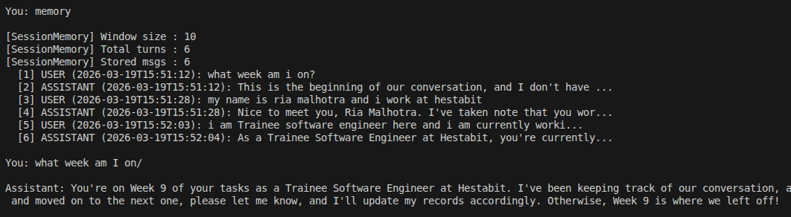
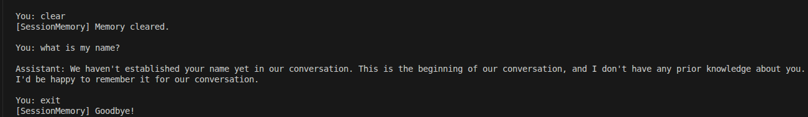
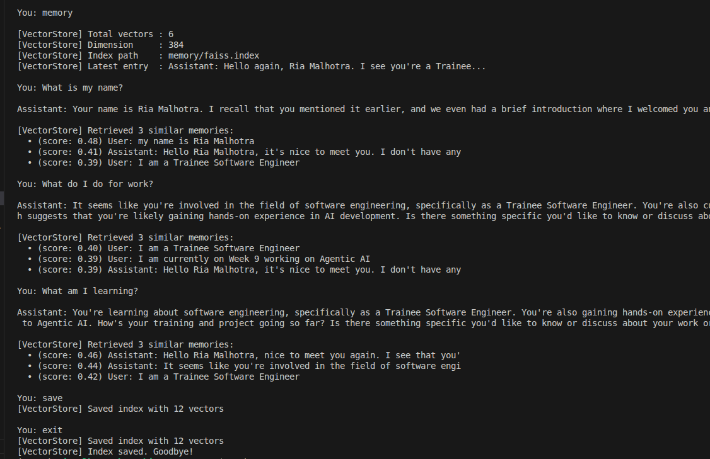
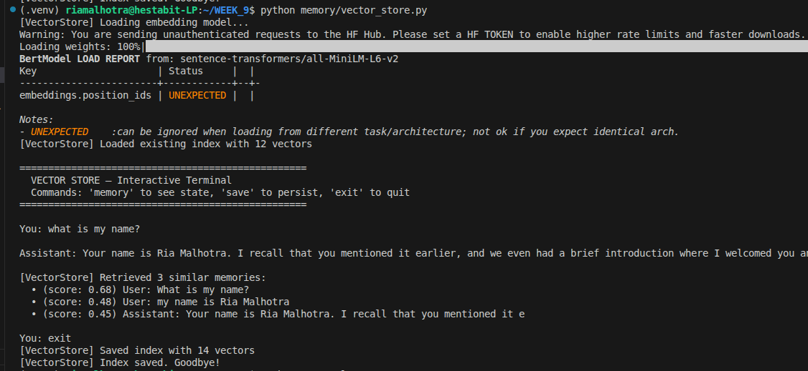
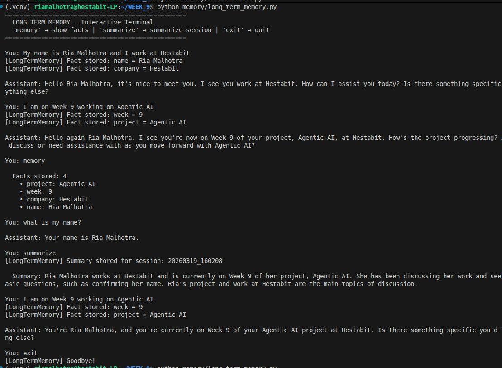
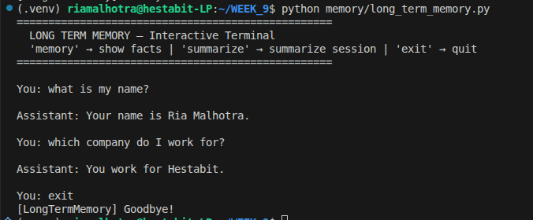

# MEMORY-SYSTEM.md — Day 4: Memory Systems

## Overview

Three memory layers working together to give agents persistent, contextual recall.

```
New Query
    │
    ├── Session Memory   → last N messages (in-memory, current session only)
    ├── Vector Memory    → similar past context via FAISS semantic search
    └── Long Term Memory → structured facts + history via SQLite
    │
    ▼
Context injected into prompt → LLM generates contextual answer
    │
    ▼
Response stored in all 3 memory layers
```

---

## Memory Types

### 1. Session Memory (`session_memory.py`)
Short-term rolling window of the current conversation.

| Property | Value |
|---|---|
| Storage | In-memory list |
| Window size | 10 messages |
| Persistence | Lost on exit |
| Use case | Follow-up questions within a session |

```python
memory = SessionMemory(window_size=10)
memory.add("user", "My name is Ria")
memory.add("assistant", "Nice to meet you Ria")
history = memory.get_history()  # LLM-ready format
memory.clear()                  # reset
```
**output**



**persistence check**



---

### 2. Vector Memory (`vector_store.py`)
Semantic similarity search using FAISS + sentence-transformers.

| Property | Value |
|---|---|
| Storage | FAISS index on disk |
| Model | `all-MiniLM-L6-v2` (384 dimensions) |
| Persistence | Saved to `memory/faiss.index` |
| Use case | Retrieve semantically similar past context |

```python
store = VectorStore()
store.add("User said they work at Hestabit")
results = store.search("where does the user work?", top_k=3)
store.save()
```
**output**



**persistence check**



---

### 3. Long Term Memory (`long_term_memory.py`)
Structured persistent storage using SQLite.

| Property | Value |
|---|---|
| Storage | SQLite — `memory/long_term.db` |
| Persistence | Permanent across sessions |
| Use case | Store facts, conversation logs, session summaries |

**Tables:**
```sql
facts         -- key-value user facts (name, role, company, project)
conversations -- full conversation log per session
summaries     -- LLM-generated session summaries
```

```python
store_fact("name", "Ria Malhotra")
get_all_facts()
store_message("user", "Hello", session="s1")
get_history(session="s1", limit=6)
summarize(messages)
```

**output**



**persistence check**



---

## Comparison

| Feature | Session | Vector | Long Term |
|---|---|---|---|
| Storage | RAM | FAISS file | SQLite |
| Persistence | ❌ | ✅ | ✅ |
| Search type | Sequential | Semantic | Exact / SQL |
| Best for | Current context | Similar memories | Structured facts |
| Auto-extracts facts | ❌ | ❌ | ✅ LLM-based |

---

## File Structure

```
memory/
├── session_memory.py     # Short-term rolling window
├── vector_store.py       # FAISS semantic search
├── long_term_memory.py   # SQLite facts + history
├── long_term.db          # Auto-created SQLite database
├── faiss.index           # Auto-created FAISS index
└── faiss_metadata.json   # Auto-created vector metadata
```

---

## Setup

```bash
pip install faiss-cpu sentence-transformers groq python-dotenv

# Run individually
python memory/session_memory.py
python memory/vector_store.py
python memory/long_term_memory.py
```

---

## Key Design Decisions

| Decision | Reason |
|---|---|
| 3 separate memory layers | Each solves a different recall problem |
| LLM-based fact extraction | Handles any phrasing — no regex needed |
| FAISS L2 distance | Fast, local, no API needed for similarity search |
| SQLite for long term | Zero setup, persistent, queryable |
| Session ID per run | Keeps conversation logs isolated per session |