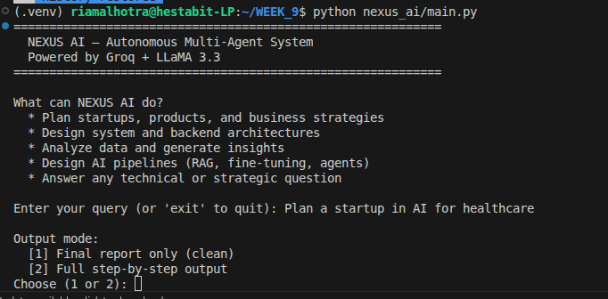

# NEXUS AI — Autonomous Multi-Agent System

NEXUS AI is a fully autonomous multi-agent system built with Groq + LLaMA 3.3. It processes any technical or strategic query through a pipeline of 9 specialized AI agents — each with a unique role, system prompt, and temperature — to produce a comprehensive, validated final report.

---

## Tech Stack

| Component | Technology |
|---|---|
| LLM | LLaMA 3.3 70B versatile (via Groq) |
| Framework | Python 3.10+ |
| Vector Memory | FAISS |
| Long-term Memory | SQLite |
| Code Execution | subprocess + tempfile |
| API | Groq SDK |
| Environment | python-dotenv |

---

## Agents

| # | Agent | Role |
|---|---|---|
| 1 | Orchestrator | Master coordinator — delegates tasks, monitors all agents 
| 2 | Planner | Breaks query into ordered steps, assigns to agents 
| 3 | Researcher | Gathers facts, background knowledge, and context 
| 4 | Coder | Writes and executes Python code for technical problems
| 5 | Analyst | Analyzes data, identifies patterns, derives insights
| 6 | Critic | Reviews all outputs, finds weaknesses and gaps 
| 7 | Optimizer | Takes critic feedback and improves previous output 
| 8 | Validator | Checks final output for correctness, approves or flags 
| 9 | Reporter | Compiles everything into a clean final report 

---

## Setup & Installation

### 1. Clone the repository
```bash
cd WEEK_9
```

### 2. Create virtual environment
```bash
python -m venv .venv
source .venv/bin/activate        # Linux/Mac
.venv\Scripts\activate           # Windows
```

### 3. Install dependencies
```bash
pip install groq python-dotenv faiss-cpu pandas scikit-learn
```

### 4. Set up environment variables
Create a `.env` file in the root directory:
```
GROQ_API_KEY_2=your_groq_api_key_here
```

### 5. Run NEXUS AI
```bash
python nexus_ai/main.py
```

---

## Usage



### Example Queries
1. `Plan a startup in AI for healthcare`
2. `Generate backend architecture for a scalable app`
3. `Analyze CSV and create a business strategy`
4. `Design a RAG pipeline for 50k documents`
5. Any custom technical or strategic question

---

## Output Modes

**Mode 1 — Final Report Only**
Shows only progress indicators and the final compiled report. Best for clean demos and quick answers.

**Mode 2 — Full Step-by-Step**
Shows all 9 agent outputs in sequence plus the final report. Best for debugging and learning.

All runs are fully saved to `nexus_ai/logs/trace.json` regardless of mode.

---

## Configuration

All settings are in `nexus_ai/config.py`:

```python
MODEL         = "llama-3.3-70b-versatile"
MAX_TOKENS    = 512
TEMPERATURE   = 0.3
MEMORY_WINDOW = 10
```
---