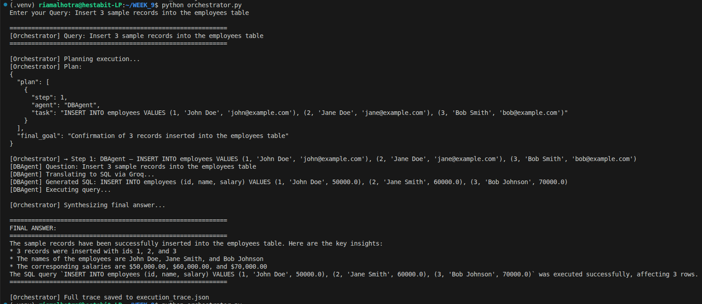

# TOOL-CHAIN.md — Day 3: Tool-Calling Agents

## Architecture

```
User Query → Orchestrator → Plans → Agents → Synthesis → Final Answer
                               ├── FileAgent    (read/write files)
                               ├── DBAgent      (SQLite queries)
                               └── CodeAgent    (Python execution)
```

---

## Agents

### FileAgent (`tools/file_agent.py`)
Reads and writes `.csv` and `.txt` files using natural language.

- **Two LLM calls:** task parser (intent extraction) + file analyzer (content summary)
- **Auto-creates** files and folders if they don't exist on write
- **Supported:** `"Read sales.csv"`, `"Write hello to notes.txt"`, `"Save X into Y.txt"`

### DBAgent (`tools/db_agent.py`)
Translates natural language to SQLite SQL and executes it.

- **Supports:** `SELECT`, `INSERT`, `UPDATE`, `DELETE`, `CREATE TABLE`, `DROP TABLE`
- **Auto-created tables:** `sales` (seeded), `employees` (on demand)
- **Supported:** `"Total revenue by product"`, `"Find highest salary employee"`

### CodeAgent (`tools/code_executor.py`)
Generates and executes any Python code in a sandboxed subprocess.

- **Supports:** general coding tasks + data analysis with pandas
- **Handles** numpy/pandas `int64`/`float64` serialization automatically

---

## Orchestrator (`orchestrator_main_day3.py`)
Plans execution, runs agents in sequence, synthesizes final answer.

- FileAgent and DBAgent always receive the **original user query** (prevents content loss from LLM rephrasing)
- CodeAgent receives the orchestrator's task (safe — no content to preserve)
- Saves full trace to `execution_trace.json` after every run

---

## Execution Flows

| Query | Agents Used |
|---|---|
| `"Read sales.csv"` | FileAgent |
| `"Write hello to output.txt"` | FileAgent |
| `"Find highest salary employee"` | DBAgent |
| `"Write binary search algorithm"` | CodeAgent |
| `"Analyze sales.csv and generate top 5 insights"` | FileAgent → CodeAgent |
| `"Read sales.csv, calculate revenue, store in SQLite"` | FileAgent → CodeAgent → DBAgent |

---

## File Structure

```
WEEK_9/
├── orchestrator_main_day3.py
├── tools/
│   ├── file_agent.py
│   ├── db_agent.py
│   └── code_executor.py
├── sales.csv               # sample data
├── sales.db                # auto-generated SQLite DB
├── execution_trace.json    # auto-generated run trace
└── TOOL-CHAIN.md
```

---

## Setup

```bash
pip install groq python-dotenv
# Add GROQ_API_KEY to .env
python orchestrator_main_day3.py
```

---

## Final Output

```bash
query= "insert 3 sample records into the employee table."
```

**screenshot**



---

## Key Design Decisions

| Decision | Reason |
|---|---|
| LLM-based task parsing in FileAgent | Handles any phrasing — no fragile regex |
| Original query passthrough | Prevents content loss from orchestrator rephrasing |
| Subprocess for code execution | Isolates generated code from main process |
| JSON output contract per agent | Makes outputs composable and debuggable |
| SQLite for DB | Zero setup, fully local, no paid services |